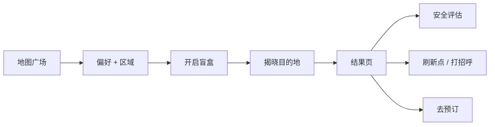

# Trip Open · 旅行盲盒原型

面向「不确定去哪儿、又想有一点惊喜」的年轻人，用**地图广场 → 偏好与区域 → 盲盒揭晓 → 结果页（安全 / 行程 / 社交刷新点）→ 预订**串联一条完整动线。本仓库是 Next.js 可交互原型，用于**产品演示、可用性走查与录屏素材**。

---

## 1. 产品定位（为什么这么设计）

| 维度 | 说明 |
|------|------|
| **问题** | 决策成本高：目的地多、信息杂；又想保留一点「被推荐」的轻惊喜。 |
| **解法** | 先收**偏好与大致区域**，再用**盲盒机制**落到具体目的地，辅以**安全心智**与**轻社交「刷新点」**，最后收口到**预订**。 |
| **原型边界** | 数据为演示用静态/半随机配置；不涉及真实支付与后端。 |

---

## 2. 核心用户旅程（设计顺序 → 界面顺序）

以下顺序与界面实现一致，可作为 PRD 层级的故事线，也可直接对照录屏分镜。

1. **发现与进入**：地图广场、目的地气泡，建立「世界很大、从这里开始」的情境。  
2. **偏好 → 目的地匹配**：在盲盒流程中勾选标签、选择区域（如亚洲 / 欧洲等），系统据此**匹配候选目的地**并完成揭晓。  
3. **开启盲盒**：点击开启、动效揭晓，强化仪式感与「结果被托付」的情绪。  
4. **结果页**：展示匹配到的城市与行程框架。  
5. **安全评估展示**：结果页内用独立模块呈现**安全指数、风险提示、备案与紧急信息**，降低「盲选＝不安全」的顾虑。  
6. **刷新点**：行程日中出现的**刷新点**入口；进入后可查看**他人分享 / 轻社交信息流**，并包含 **「我愿意打个招呼」** 等同意与互动设计（演示同意流即可）。  
7. **去预订**：底部主行动**去预订**，进入预订页完成演示闭环。

---

## 3. 演示 / 录屏脚本（建议 3～5 分钟）

将下表当作**分镜表**：左边是**产品设计意图**，右边是**操作与口播要点**。录屏时按顺序走一遍即可与 README 同步维护。

| 时间点（约） | 画面 / 步骤 | 口播与观察点 |
|--------------|-------------|----------------|
| 0:00–0:30 | 首页地图广场，可轻微缩放或点气泡 | 「用户从广场进入，先感知可选目的地氛围。」 |
| 0:30–1:15 | 进入盲盒；勾选**偏好**、选择**区域** | 「偏好 + 区域 = 匹配池；这里演示我们如何缩小范围。」 |
| 1:15–1:45 | 点击**开启盲盒**，看完揭晓动效 | 「仪式感；揭晓后进入结果页。」 |
| 1:45–2:30 | 结果页上滑浏览，**展开 / 强调安全评估**区块 | 「盲盒不等于冒险——安全与备案信息前置。」 |

| 2:30–3:15 | 点到某日**刷新点**，打开弹层，展示列表与**我愿意打个招呼** | 「轻社交：用户可控、先同意再互动。」 |
| 3:15–3:45 | 关闭刷新点，点击底部 **去预订** | 「动线收口到预订，演示转化路径。」 |
| 收尾 | 可选：再录一条「换一组偏好/区域 → 不同目的地」 | 「证明匹配逻辑可感知，不仅单次录屏。」 |

**录屏小贴士**：浏览器 1280×720 或 1920×1080；隐藏书签栏；用同一组偏好录主干，另录一条变体更有说服力。

---

## 4. 许可与说明

本项目为**内部 / 演示用原型**。数据与第三方面孔、地名等均为演示用途，不代表真实服务承诺。

若你把演示视频公開，建议在视频简介中注明：**原型演示，非商业上架产品**。
